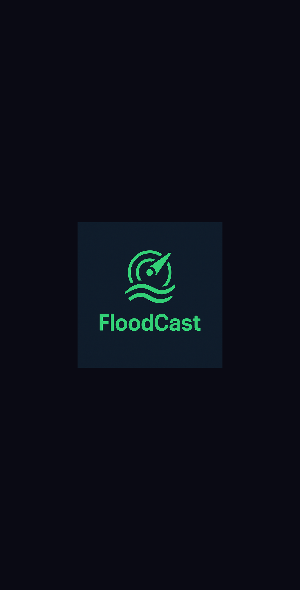

# FloodCast - Flood Risk Monitoring System

<div align="center">
  
</div>

## 📱 Project Overview

FloodCast is a comprehensive mobile application designed to monitor and manage flood risks in urban areas. The system combines IoT sensor data with a user-friendly mobile interface to provide flood risk information, helping municipalities and citizens respond effectively to potential flooding events.

This project was developed as part of a coding challenge to demonstrate full-stack development capabilities, with a focus on creating a robust, scalable, and user-friendly solution.

## 🌟 Key Features

- **Interactive Flood Risk Map**: Visualization of flood risk areas with color-coded risk levels
- **Detailed Risk Information**: Comprehensive data on water levels, affected areas, and emergency contacts
- **User Location Tracking**: Personalized risk assessment based on user's current location
- **Dark/Light Mode Support**: Fully responsive UI with theme support for optimal viewing in all conditions
- **Authentication System**: Secure JWT-based authentication
- **Emergency Contact System**: Quick access to emergency services during flood events

## 🛠️ Technology Stack

### Frontend
- **React Native** with **Expo** framework for cross-platform mobile development
- **TypeScript** for type safety and improved developer experience
- **NativeWind** (Tailwind for React Native) for consistent, responsive styling (very limited use of stylesheet in occasions where Nativewind isn't supported)
- **Expo Router** for declarative, file-based navigation
- **React Native Maps** for interactive map functionality (Apple Maps on iOS, Google Maps on Android)

### Backend
- **Node.js** with **Express** for RESTful API development
- **PostgreSQL** for reliable, relational data storage
- **JWT** for secure authentication
- **bcrypt** for password hashing
- **Swagger/OpenAPI** for comprehensive API documentation

### DevOps
- **EAS Build** for streamlined deployment and testing
- **Vercel** for backend hosting

## 🏗️ Architecture

The application follows a modern, modular architecture:

1. **Frontend Layer**: React Native mobile application with component-based UI
2. **API Layer**: Express.js RESTful API with middleware for authentication and validation
3. **Data Layer**: PostgreSQL database with optimized schema for sensor data
4. **IoT Integration**: Custom middleware for processing sensor data with bitflag decoding

## 📂 Project Structure

```
floodcast/
├── app/                    # Main application code (Expo Router)
│   ├── (tabs)/             # Tab-based navigation screens
│   ├── _layout.tsx         # Root layout component
│   └── index.tsx           # Entry point
├── assets/                 # Static assets (images, fonts)
├── components/             # Reusable UI components
├── constants/              # App constants and theme configuration
├── context/                # React context providers
├── hooks/                  # Custom React hooks
├── services/               # API service layer
├── types/                  # TypeScript type definitions
├── utils/                  # Utility functions
├── Backend/                # Backend Express.js application
│   ├── routes/             # API route definitions
│   ├── middleware/         # Express middleware
│   ├── docs/               # API documentation
│   └── data/               # Data processing scripts
└── documentation/          # Project documentation
```

## 🚀 Getting Started

### Prerequisites
- Node.js ≥ 14.x
- npm or yarn
- PostgreSQL ≥ 12
- Expo CLI (`npm install -g expo-cli`)
- EAS CLI (`npm install -g eas-cli`)

### Installation

1. Clone the repository
   ```bash
   git clone https://github.com/yourusername/floodcast.git
   cd floodcast
   ```

2. Install dependencies
   ```bash
   npm install
   ```

3. Set up environment variables
   ```bash
   cp .env.example .env
   # Edit .env with your configuration
   ```

   For Google Maps to work properly, you need to:
   - Obtain a Google Maps API key from the [Google Cloud Console](https://console.cloud.google.com/)
   - Enable the Maps SDK for Android and Maps SDK for iOS
   - Add your API key to the .env file:
     ```
     MAPS_API_KEY=your_google_maps_api_key_here
     ```
   - For production builds, you'll need to add restrictions to your API key in the Google Cloud Console:
     - For Android: Add your app's package name and SHA-1 certificate fingerprint
     - For iOS: Add your app's bundle identifier

4. Set up the database (from backend branch if vercel is down)
   ```bash
   npm run setup-db
   npm run create-tables
   npm run seed-db
   ```

5. Start the backend server
   ```bash
   npm run dev
   ```

6. Start the frontend application
   ```bash
   npx expo start or bun s
   ```

### Testing on Physical Devices

For testing on physical devices, we use EAS Preview builds:

1. Prebuild for your target platform
   ```bash
   npx expo prebuild --platform android  # or ios
   ```

2. Create a preview build
   ```bash
   eas build --profile preview --platform android  # or ios
   ```

3. Scan the QR code with your device to install the preview build

## 🧪 Design Decisions & Trade-offs

### Authentication
I implemented JWT-based authentication with bcrypt password hashing for security. Token expiration is set to 1 hour as a balance between security and convenience.

### Map Implementation
I chose React Native Maps for its cross-platform compatibility and performance. The map displays flood risk areas as color-coded circles with interactive markers. Risk levels are calculated based on water level and rate of change data from sensors.

### Styling Approach
NativeWind was selected for styling to maintain consistency across the application while leveraging the familiarity of Tailwind CSS. This approach significantly reduced development time and improved maintainability.

### Data Fetching Strategy
The application uses custom hooks for data fetching with built-in error handling and fallback to mock data when API calls fail. This ensures the app remains functional even with intermittent connectivity.


## 📈 Future Improvements

With additional time, the team would implement:

1. **Predictive Analytics**: Machine learning models to predict flooding based on weather forecasts and historical data
2. **Community Reporting**: Allow users to submit flood reports with photos and descriptions
3. **Offline Map Caching**: Download map data for offline use in emergency situations
4. **Multi-language Support**: Localization for multiple languages to serve diverse communities


